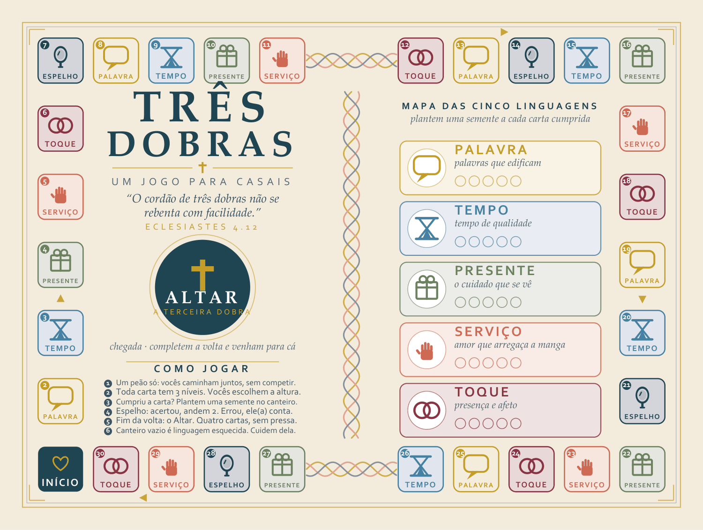
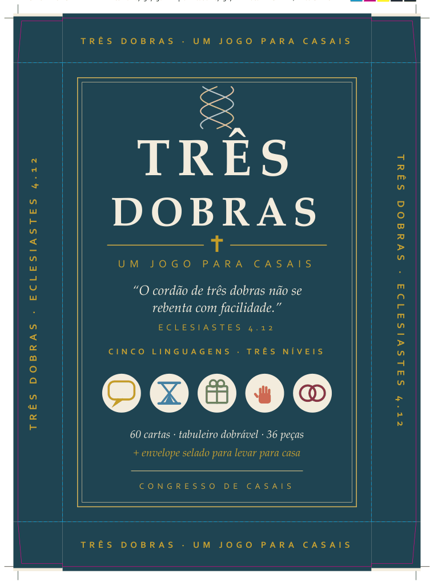
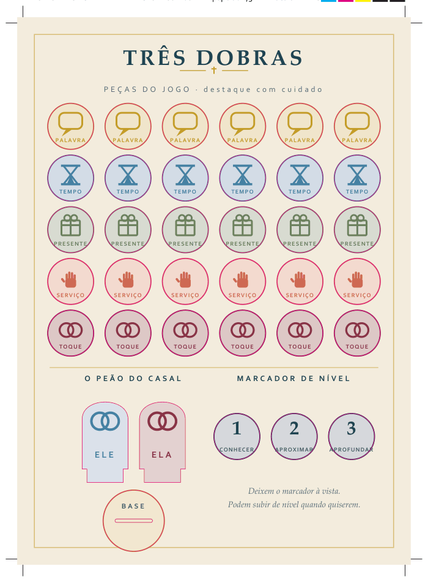

# TRÊS DOBRAS

**Um jogo de tabuleiro cooperativo para casais.**
Arte de impressão offset gerada 100 % por código.

> *"O cordão de três dobras não se rebenta com facilidade."* — Eclesiastes 4.12

📖 **[Manual interativo](https://fleandro1234-netizen.github.io/tres-dobras/)** —
tabuleiro com pontos clicáveis, as 60 cartas navegáveis por naipe e nível, e a
ficha técnica completa.



---

## O jogo

Ninguém ganha. Os dois chegam.

O casal move **um único peão** por uma trilha de 30 casas. Não há disputa, não há
quem esteja na frente — existe uma volta a ser dada juntos e um Altar no fim dela.

**Três níveis em cada carta.** Toda carta traz a mesma pergunta em três
profundidades — *Conhecer*, *Aproximar*, *Aprofundar*. O casal escolhe a altura da
barra e pode subir quando quiser. É o que permite entregar o mesmo jogo para quem
namora há um mês e para quem é casado há vinte anos.

**Cinco linguagens viram naipes.** Palavra, Tempo, Presente, Serviço e Toque. Cada
carta cumprida planta uma semente no canteiro correspondente, impresso no próprio
tabuleiro. O canteiro que ficar vazio no fim é o diagnóstico do casal.

**O envelope não se abre no evento.** As dez cartas do *Jardim Fechado* tratam da
intimidade conjugal na linguagem de Cântico dos Cânticos. Saem lacradas: são para
casais casados, a sós, em casa.

### Como se joga

1. **Escolham o nível** — 1 Conhecer, 2 Aproximar ou 3 Aprofundar. O marcador fica à vista.
2. **Rolem o dado e avancem** — um peão só, movido pelos dois.
3. **Puxem a carta da cor da casa** — leiam a pergunta do nível escolhido em voz alta.
4. **Plantem a semente** — no canteiro daquela linguagem. A única regra é a honestidade.
5. **Cheguem ao Altar** — Gratidão, Perdão, Bênção e Pacto. O Pacto se assina no verso do tabuleiro.
6. **Levem o envelope para casa.**

---

## Os três projetos de impressão

| | Formato final | Suporte |
|---|---|---|
| **Tabuleiro** | 400 × 300 mm, vinco em x = 200 | cartão 300 g/m², 4/4 |
| **Caixa** (tampa e fundo) | interno 207×307×30 e 203×303×28 | triplex 350 g/m², 4/0 |
| **Peças** | 60 cartas 70×120 · cartela 200×280 · dado · envelope | ver ficha técnica |

Tudo vetorial em **CMYK**, perfil Coated FOGRA39, tinta total ≤ 300 %, preto de
texto 100 % K puro, **sangria de 3 mm**, fontes embutidas.

📄 **[Ficha técnica completa para a gráfica →](LEIA-ME-GRAFICA.md)**

<table>
<tr>
<td width="50%"></td>
<td width="50%"></td>
</tr>
<tr>
<td align="center"><sub>Caixa · tampa planificada · 267 × 367 mm</sub></td>
<td align="center"><sub>Cartela · 36 peças destacáveis · 200 × 280 mm</sub></td>
</tr>
</table>

### A dobra

O requisito mais duro do projeto era o vinco não cortar texto. A solução foi de
desenho, não de diagramação: **as casas do tabuleiro carregam só ícone e cor** — a
pergunta mora na carta. Isso liberou a faixa central inteira.

A única coisa que atravessa a dobra é a trança do cordão: traço fino, sem texto.
É proposital — o cordão é o que une as duas metades.

`src/verificar.py` abre o PDF final e mede, **palavra por palavra**, a distância
até o eixo do vinco:

```
pagina 1: 254 palavras dentro do trim | folga minima ate o eixo da dobra: 28,5 mm
pagina 2: 334 palavras dentro do trim | folga minima ate o eixo da dobra: 22,0 mm
OK — nenhum texto invade a zona morta do vinco.
```

Exigido: 7 mm para cada lado. O verificador foi testado com sabotagem deliberada
(uma palavra plantada sobre o vinco) e acusou a falha — então o `OK` acima não é
um teste que passa sempre.

---

## Estrutura

```
01-TABULEIRO/    PDF frente e verso, com e sem marcas de corte
02-CAIXA/        facas planificadas da tampa e do fundo
03-PECAS/        cartas, cartela, dado, envelope + folha de conferência
04-PNG-300DPI/   rasters em 300 dpi (tabuleiro 4796 × 3615 px)
docs/            manual interativo (GitHub Pages) e imagens
src/             gerador em Python
LEIA-ME-GRAFICA.md
```

## Regerar a arte

Requer Python 3 com `reportlab`, `pillow` e `pymupdf`.

```bash
pip install reportlab pillow pymupdf
python src/gerar_tudo.py --png300   # os 3 projetos + previews + PNG 300 dpi
python src/verificar.py             # confere a zona morta do vinco
python src/manual.py                # regera o manual interativo
```

| Arquivo | O que muda |
|---|---|
| `src/dados.py` | textos das 60 cartas, regras, Pacto — **fonte única**, alimenta PDF e manual |
| `src/comum.py` | paleta CMYK, fontes, ícones vetoriais, marcas de impressão |
| `src/tabuleiro.py` · `caixa.py` · `cartas.py` · `pecas.py` | layout de cada projeto |

### Armadilhas conhecidas

- **reportlab:** `Canvas` não tem `setCharSpace`. Use um *text object* dentro de
  `saveState`/`restoreState` — o `Tc` do PDF vaza para todos os textos seguintes.
- **Canvas escalado em mm:** o tamanho da fonte é em **milímetros**, não em pontos.
  Corpo de texto de carta fica na faixa 3,5–5 unidades.
- **OneDrive:** trava PDFs recém-escritos e o Acrobat segura o handle. Por isso
  `salvar()` monta em `BytesIO` e grava com retry, e `gerar_tudo.py` pula e lista
  os arquivos travados em vez de morrer no meio.

---

## Licença

[CC BY-NC-SA 4.0](LICENSE) — use, adapte e imprima à vontade, inclusive na sua
igreja ou no seu evento. Só não venda, e mantenha a mesma licença nas adaptações.

Feito para ser dado de presente. Se ele servir a algum casal, já valeu.
